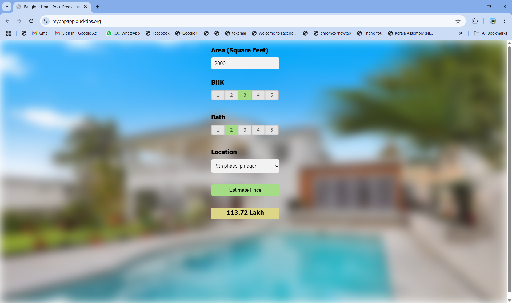

# 🏠 Bangalore House Price Prediction

A **Machine Learning web application** that predicts house prices in Bangalore based on user inputs such as location, square footage, number of bedrooms, and number of bathrooms.  
Built using **Linear Regression** and deployed on **AWS EC2** with **Nginx** and **Gunicorn**.

---

## Live Demo
🔗 **[Click here to try the app](https://mybhpapp.duckdns.org/)**  
*(Hosted on AWS EC2, secured with HTTPS)*

---

##  Screenshot


---

## Features
- **Machine Learning Model**: Linear Regression
- Predicts price based on:
  - Location
  - Square footage
  - Bedrooms (BHK)
  - Bathrooms
- Interactive **web UI** built with HTML, CSS, and JavaScript
- REST API powered by **Flask**
- Hosted on **AWS EC2 Ubuntu instance** with **Nginx** reverse proxy
- **Gunicorn** as the production WSGI server
- Free domain using **DuckDNS**
- HTTPS encryption with **Certbot**

---

## Tech Stack
**Backend**:
- Python
- Flask
- scikit-learn
- pandas
- numpy

**Frontend**:
- HTML5, CSS3, JavaScript

**Deployment**:
- AWS EC2
- Nginx
- Gunicorn
- DuckDNS
- Certbot (SSL)

---

## 📂 Project Structure
BHP/
├── Client/ # Frontend (HTML, CSS, JS)
│ └── app.html
├── Server/ # Backend (Flask API)
│ ├── server.py
│ ├── util.py
│ └── artifacts/ # Model & Columns JSON
├── model/ # Jupyter Notebook training file
├── requirements.txt
└── README.md


---

##  How It Works
1. **Frontend** collects user input.
2. **Flask API** receives the request at `/api/predict_home_price`.
3. The API loads the **Linear Regression model** and **columns.json**.
4. Prediction is returned to the frontend and displayed to the user.

---

## 📦 Installation (Run Locally)
```bash
# Clone the repo
git clone git@github.com:Akshayaraj99/BangloreHousePricePrediction.git

# Navigate to Server directory
cd BHP/Server

# Install dependencies
pip install -r requirements.txt

# Run the Flask app
python server.py

